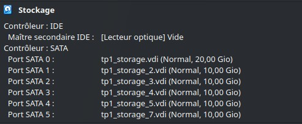

# TP1 : Single Machine Storage. 

### I. Fundamentals 

Bonjour, bonsoir nous allons commencer par mettre en forme notre VM avec la petite checklist du plaisir. 
On a ssh tout le bazar avec la vm clonée. 

Nous avons commencé avec les disques : 


Puis le hostname : 
````
[mmederic@storage ~]$ hostname
storage.b3
````

On liste nos différents disques, avec uniquement le sda qui a ses partitions : 
````
[mmederic@storage ~]$ lsblk
NAME        MAJ:MIN RM  SIZE RO TYPE MOUNTPOINTS
sda           8:0    0   20G  0 disk 
├─sda1        8:1    0    1G  0 part /boot
└─sda2        8:2    0   19G  0 part 
  ├─rl-root 253:0    0   17G  0 lvm  /
  └─rl-swap 253:1    0    2G  0 lvm  [SWAP]
sdb           8:16   0   10G  0 disk 
sdc           8:32   0   10G  0 disk 
sdd           8:48   0   10G  0 disk 
sde           8:64   0   10G  0 disk 
sdf           8:80   0   10G  0 disk 
sr0          11:0    1 1024M  0 rom  
````

On récupère entre temps smartmontools pour smartctl. 
Une petite recherche de docs sur internet, un search et on installe : 
````
[mmederic@storage ~]$ sudo dnf search smartmontools
[sudo] password for mmederic: 
Last metadata expiration check: 2:16:35 ago on Thu 14 Nov 2024 11:54:21 CET.
======================================= Name Exactly Matched: smartmontools ========================================
smartmontools.x86_64 : Tools for monitoring SMART capable hard disks
[mmederic@storage ~]$ sudo dnf install smartmontools -y
Installed:
  smartmontools-1:7.2-9.el9.x86_64                                                                 
Complete!
````

MAIS : 
````
[mmederic@storage ~]$ sudo smartctl -s on /dev/sda 
smartctl 7.2 2020-12-30 r5155 [x86_64-linux-5.14.0-427.42.1.el9_4.x86_64] (local build)
Copyright (C) 2002-20, Bruce Allen, Christian Franke, www.smartmontools.org

SMART support is: Unavailable - device lacks SMART capability.
A mandatory SMART command failed: exiting. To continue, add one or more '-T permissive' options.
````

On affiche l'espace disk disponible sur /, j'ai trouvé cette commande : 
````
[mmederic@storage ~]$ df -H /
Filesystem           Size  Used Avail Use% Mounted on
/dev/mapper/rl-root   19G  1.7G   17G  10% /
````

Avec cette commande, on a la dispo des inodes restants et ceux utilisés, toujours sur / : 
````
[mmederic@storage ~]$ df -i / 
Filesystem           Inodes IUsed   IFree IUse% Mounted on
/dev/mapper/rl-root 8910848 37474 8873374    1% /
````

On install ioping via epel-release : 
````
[mmederic@storage ~]$ sudo dnf install epel-release -y
Complete !
[mmederic@storage ~]$ sudo dnf --enablerepo="epel" install ioping
Complete !
````

On fait notre premier test de latence sur /dev/sda : 
````
[mmederic@storage ~]$ sudo ioping -A /dev/sda
sudo ioping -A /dev/sda
4 KiB <<< /dev/sda (block device 20 GiB): request=1 time=7.26 ms (warmup)
4 KiB <<< /dev/sda (block device 20 GiB): request=2 time=3.98 ms
4 KiB <<< /dev/sda (block device 20 GiB): request=3 time=7.75 ms
4 KiB <<< /dev/sda (block device 20 GiB): request=4 time=618.8 us
4 KiB <<< /dev/sda (block device 20 GiB): request=5 time=725.1 us
^C
--- /dev/sda (block device 20 GiB) ioping statistics ---
4 requests completed in 13.1 ms, 16 KiB read, 306 iops, 1.20 MiB/s
generated 5 requests in 4.78 s, 20 KiB, 1 iops, 4.19 KiB/s
min/avg/max/mdev = 618.8 us / 3.27 ms / 7.75 ms / 2.92 ms
````

On a donc une latence moyenne de 3.27ms sur 5 ping. 

On va retrouver la taille de notre fscache : 
````
[mmederic@storage ~]$ free -h
               total        used        free      shared  buff/cache   available
Mem:           769Mi       191Mi       564Mi       0.0Ki       126Mi       577Mi
Swap:          2.0Gi        59Mi       1.9Gi
````

On a quelques manières différentes d'obtenir les infos de notre mémoire : 
````
[mmederic@storage ~]$ grep -E --color 'Mem|Cache|Swap|Buff' /proc/meminfo
MemTotal:         787688 kB
MemFree:          578080 kB
MemAvailable:     591512 kB
Buffers:               0 kB
Cached:           106760 kB
SwapCached:         4292 kB
SwapTotal:       2097148 kB
SwapFree:        2036056 kB
````

### II. Partitioning. 

On commence par check nos disk : 
````
[mmederic@storage ~]$ lsblk
NAME        MAJ:MIN RM  SIZE RO TYPE MOUNTPOINTS
sda           8:0    0   20G  0 disk 
├─sda1        8:1    0    1G  0 part /boot
└─sda2        8:2    0   19G  0 part 
  ├─rl-root 253:0    0   17G  0 lvm  /
  └─rl-swap 253:1    0    2G  0 lvm  [SWAP]
sdb           8:16   0   10G  0 disk 
sdc           8:32   0   10G  0 disk 
sdd           8:48   0   10G  0 disk 
sde           8:64   0   10G  0 disk 
sdf           8:80   0   10G  0 disk 
sr0          11:0    1 1024M  0 rom
````

Puis on commence avec le PV de sdb : 
````
[mmederic@storage ~]$ sudo pvcreate /dev/sdb
  Physical volume "/dev/sdb" successfully created.
[mmederic@storage ~]$ sudo pvs
  PV         VG Fmt  Attr PSize   PFree 
  /dev/sda2  rl lvm2 a--  <19.00g     0 
  /dev/sdb      lvm2 ---   10.00g 10.00g
````

On suit avec le VG : 
````
[mmederic@storage ~]$ sudo vgcreate storage /dev/sdb
  Volume group "storage" successfully created
````

Puis on continue avec smol_data & big_data: 
````
[mmederic@storage ~]$ sudo lvcreate -L 2G storage -n smol_data
  Logical volume "smol_data" created.
[mmederic@storage ~]$ sudo lvcreate -L 7.99G storage -n big_data
  Rounding up size to full physical extent 7.99 GiB
  Logical volume "big_data" created.
[mmederic@storage ~]$ sudo lvs
  LV        VG      Attr       LSize   Pool Origin Data%  Meta%  Move Log Cpy%Sync Convert
  root      rl      -wi-ao---- <17.00g                                                    
  swap      rl      -wi-ao----   2.00g                                                    
  big_data  storage -wi-a-----   7.99g                                                    
  smol_data storage -wi-a-----   2.00g   
````

On va créer le système de fichier en ext4 :
````
[mmederic@storage ~]$ sudo mkfs.ext4 /dev/storage/smol_data
mke2fs 1.46.5 (30-Dec-2021)
Creating filesystem with 524288 4k blocks and 131072 inodes
Filesystem UUID: 0a2532ab-a859-4d42-ab0f-97a9e8e27e3b
Superblock backups stored on blocks: 
        32768, 98304, 163840, 229376, 294912

Allocating group tables: done                            
Writing inode tables: done                            
Creating journal (16384 blocks): done
Writing superblocks and filesystem accounting information: done 

[mmederic@storage ~]$ sudo mkfs.ext4 /dev/storage/big_data
mke2fs 1.46.5 (30-Dec-2021)
Creating filesystem with 2095104 4k blocks and 524288 inodes
Filesystem UUID: 7de4c21e-9d95-40df-bab7-9dc13de10d99
Superblock backups stored on blocks: 
        32768, 98304, 163840, 229376, 294912, 819200, 884736, 1605632

Allocating group tables: done                            
Writing inode tables: done                            
Creating journal (16384 blocks): done
Writing superblocks and filesystem accounting information: done 
````

On va créer et monter les partitions : 
````
[mmederic@storage ~]$ sudo mkdir /mnt/lvm_storage/
[mmederic@storage ~]$ sudo mkdir /mnt/lvm_storage/smol
[mmederic@storage ~]$ sudo mount /dev/storage/smol_data /mnt/lvm_storage/smol
[mmederic@storage ~]$ sudo mkdir /mnt/lvm_storage/big
[mmederic@storage ~]$ sudo mount /dev/storage/big_data /mnt/lvm_storage/big
````

Les partitions sont bien montées : 
````
[mmederic@storage system]$ df -h
Filesystem                     Size  Used Avail Use% Mounted on
devtmpfs                       4.0M     0  4.0M   0% /dev
tmpfs                          385M     0  385M   0% /dev/shm
tmpfs                          154M  3.1M  151M   3% /run
/dev/mapper/rl-root             17G  1.8G   16G  11% /
/dev/sda1                      960M  309M  652M  33% /boot
tmpfs                           77M     0   77M   0% /run/user/1000
/dev/mapper/storage-smol_data  2.0G   24K  1.8G   1% /mnt/lvm_storage/smol
/dev/mapper/storage-big_data   7.8G   24K  7.4G   1% /mnt/lvm_storage/big
````

On umount pour le automount, on vérif et c'est bon : 
````
[mmederic@storage system]$ sudo umount /mnt/lvm_storage/smol
[mmederic@storage system]$ sudo umount /mnt/lvm_storage/big
[mmederic@storage system]$ df -h
Filesystem           Size  Used Avail Use% Mounted on
devtmpfs             4.0M     0  4.0M   0% /dev
tmpfs                385M     0  385M   0% /dev/shm
tmpfs                154M  3.1M  151M   3% /run
/dev/mapper/rl-root   17G  1.8G   16G  11% /
/dev/sda1            960M  309M  652M  33% /boot
tmpfs                 77M     0   77M   0% /run/user/1000
````
